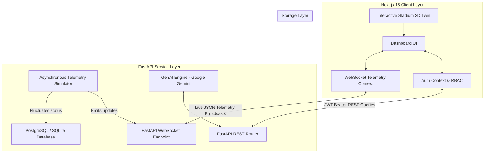

# Stadium OS AI — GenAI Smart Stadium Operations Platform

**"One Intelligent Platform for Every Stadium Experience."**

Stadium OS AI is an enterprise-grade smart venue management and intelligence platform designed for the FIFA World Cup 2026. The platform aggregates live turnstile flow, parking occupancy, metro delays, and carbon emissions telemetry, overlaying it on an interactive 3D Digital Twin stadium model and utilizing Generative AI (via Google Gemini) to automatically draft incident briefs, optimize shuttle schedules, and provide accessible routing.

---

## 🏗️ System Architecture Flow

---

## 🎨 Visual Identity & Theme Tokens

*   **Background Base:** Dark glass panels styled with blur-backdrop layers over a custom animated Aurora Mesh Gradient.
*   **Signature Color Palette:**
    *   `Midnight Emerald` (`#021210` to `#062925`): Primary dark container backing.
    *   `Electric Cyan` (`#00D9FF`): Highlighting active system states.
    *   `Aurora Mint` (`#73FFD8`): Standard confirmation parameters and accent borders.
    *   `Royal Indigo` (`#4F46E5`): Accent gradient and operations HUD backgrounds.
*   **Status Indicators:**
    *   `Neon Lime` (`#CCFF00`): Normal operating loads.
    *   `Solar Gold` (`#F59E0B`): Warning congestion thresholds.
    *   `Cyber Orange` (`#FF5722`): Alarm, bottlenecks, and critical emergency dispatches.

---

## 🛠️ Technology Stack

*   **Frontend Client:** React 19, Next.js 15 (App Router), TypeScript, TailwindCSS, HTML5 Canvas 3D Perspective, Recharts.
*   **Backend Server:** FastAPI, Python 3.11, SQLAlchemy (ORMs), Uvicorn, Websockets.
*   **Database:** SQLite (development fallback auto-seeded) / PostgreSQL compatible.
*   **GenAI Engine:** Google Generative AI (Gemini-1.5-Flash) with integrated rule-based semantic fallbacks for offline execution.
*   **Deployment:** Docker, Docker-compose, Kubernetes resources, and GitHub Actions CI/CD workflows.

---

## 🚀 Step-by-Step Installation Guide

For complete guidelines on running and testing this application locally, please consult the operational walkthrough documentation:

👉 **[Launch Walkthrough Guide (walkthrough.md)](file:///C:/Users/vishn/.gemini/antigravity-ide/brain/073a1a6e-df04-43fa-80fa-62e1665ed2ee/walkthrough.md)**

---

## 🔑 Preseeded Operational Accounts (Quick Test)

| Account Role | Email Address | Password | Features Unlocked |
| :--- | :--- | :--- | :--- |
| **Operations Commander** | `admin@stadiumos.ai` | `admin123` | Full dashboard access, settings management, system diagnostic audit logs. |
| **Security Lead** | `security@stadiumos.ai` | `password123` | Incident logging, dispatcher dashboards, crowd emotion analyses. |
| **Medical Chief** | `medical@stadiumos.ai` | `password123` | Incident tracking, medical dispatches, triage logs. |
| **General Fan** | `john@stadiumos.ai` | `password123` | Companion app view, QR ticket scanning, seat upgrades, AI translator. |
